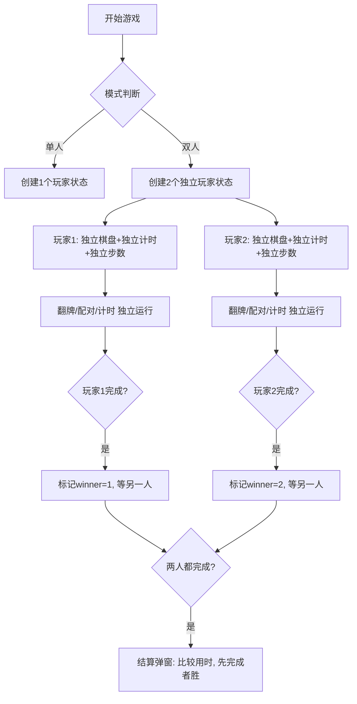

# 翻牌记忆配对游戏 - 开发运行记录

## 项目概述
创建一个纯前端 HTML/CSS/JS 翻牌记忆配对游戏，所有代码整合在一个 HTML 文件中。

---

## 开发步骤记录

### 步骤 1: 检查工作环境
- **时间**: 2026-06-22
- **操作**: 检查当前工作目录 `f:\shh-0004` 的结构
- **结果**: 
  - 目录中存在 `README.md` 文件
  - Git 仓库已初始化，当前在 `main` 分支
  - 工作区干净，无待提交文件
  - 已关联远程仓库 `origin/main`

### 步骤 2: 创建游戏主文件 index.html
- **时间**: 2026-06-22
- **操作**: 创建完整的游戏文件 `f:\shh-0004\index.html`
- **实现功能**:

#### ✅ 核心功能
1. **三种难度选择**
   - 简单模式: 4×4 (8对卡牌，共16张)
   - 中等模式: 6×6 (18对卡牌，共36张) - 默认
   - 困难模式: 8×8 (32对卡牌，共64张)

2. **两种游戏模式**
   - 单人模式: 计时 + 计步
   - 双人对战: **各自独立棋盘同时竞技**，同一时间各自翻自己的牌，互不影响，先完成者获胜

3. **翻牌动画**
   - 3D 翻转效果 (CSS `transform-style: preserve-3d` + `rotateY`)
   - 配对成功脉冲动画 (`matchPulse` keyframes)
   - 卡背渐变流动动画 (`gradientShift`)

4. **计时和计步**
   - 实时计时器，精确到秒
   - 每翻开两张卡计为一步
   - 显示配对进度 (已配对/总数)

5. **暂停/继续功能**
   - 暂停时遮罩覆盖棋盘，显示"已暂停"
   - 暂停期间计时器停止
   - 按钮文字在"暂停"/"继续"间切换

6. **localStorage 历史排行榜**
   - 单人榜: 按难度排序，同难度按用时+步数排名
   - 双人榜: 按难度排序，显示双方得分对比
   - 前3名有金银铜特殊样式
   - 最多保存 50 条记录
   - 可切换标签查看不同榜单

7. **胜利结算弹窗**
   - 单人: 显示用时和步数，🎉 动画
   - 双人: 判断胜负，显示双方得分
     - 🏆 玩家1获胜 / 🎖️ 玩家2获胜 / 🤝 平局
   - 支持一键再来一局

8. **UI 设计**
   - 深色主题，紫色渐变背景
   - 毛玻璃面板效果 (`backdrop-filter: blur`)
   - 响应式布局，手机电脑自适应
   - 圆角按钮 + 阴影效果
   - Toast 提示消息
   - emoji 图标 (🐶🐱🐭等64种动物表情)

#### 📁 文件结构
- 单文件 HTML，内嵌 CSS 和 JS
- CSS: ~450 行样式定义
- JS: ~435 行游戏逻辑
- 使用 IIFE 封装，避免全局污染

### 步骤 3: Git 提交
- **时间**: 2026-06-22
- **操作**: 将新增文件添加到 Git 并提交
- **提交文件**:
  - `index.html` - 游戏主文件
  - `运行记录.md` - 本文档
- **提交信息**: feat: 新增翻牌记忆配对游戏

### 步骤 4: 推送到远程仓库
- **时间**: 2026-06-22
- **操作**: git push origin main
- **结果**: 推送到远程仓库完成

### 步骤 5: 修复双人模式 - 改为独立棋盘竞技
- **时间**: 2026-06-22
- **问题**: 原双人模式是两人轮流翻同一套牌，不符合预期
- **需求**: 双人模式应该各自独立开局，同时翻自己的牌，互不影响，先完成者获胜
- **修改内容**:
  - **HTML结构**: 新增双棋盘容器 `boards-container`，双人模式时并排显示两个 `player-board`，中间有 VS 徽章
  - **CSS样式**: 
    - 玩家1棋盘蓝色边框 (`--p1-color: #3b82f6`)
    - 玩家2棋盘粉色边框 (`--p2-color: #ec4899`)
    - 每个棋盘独立标题栏，显示玩家用时、步数、进度
    - 完成后棋盘变半透明，显示"已完成 ✓"徽章
    - 小屏幕自动改为上下布局
  - **JS逻辑**:
    - 新增 `createPlayerState()` 工厂函数，为每个玩家创建独立状态
    - 每个玩家有独立的 cards/flipped/matched/moves/elapsed/timer/isProcessing/finished
    - `handleCardClick(playerNum, cardId)` 明确区分操作的是哪个玩家
    - `checkMatch(playerNum)` 独立处理每个玩家的配对逻辑
    - `checkWin(playerNum)` 当某玩家完成时记录 winner，等两人都完成后结算
    - `startAllTimers()` 同时启动所有玩家计时器
    - 胜利结算比较双方用时，先完成者获胜
  - **排行榜**: 双人榜记录每个玩家独立的用时和步数，显示胜者

### 步骤 6: 提交修复并推送
- **时间**: 2026-06-22
- **操作**: git add + commit + push
- **结果**: 修复已推送到远程仓库

### 步骤 7: 启动本地服务器验证
- **时间**: 2026-06-22
- **操作**: 启动 Python HTTP 服务器
- **结果**: 可通过 http://localhost:8000 访问验证

---

## 技术实现原理

### 游戏状态机
```
未开始 → 进行中 ↔ 已暂停
   ↓        ↓
 退出     已胜利(结算弹窗)
```

### 双人模式架构图


### 玩家状态数据结构
```javascript
function createPlayerState(playerNum) {
  return {
    player: playerNum,      // 1 or 2
    cards: [],              // 独立卡牌数组
    flipped: [],            // 已翻开未配对
    matched: [],            // 已配对
    moves: 0,               // 步数
    elapsed: 0,             // 已用时间(ms)
    startTime: null,        // 开始时间戳
    timer: null,            // 独立计时器
    isProcessing: false,    // 防止连点锁
    finished: false,        // 是否已完成
    finishTime: null        // 完成时的用时
  };
}
```

### 卡牌数据结构
```javascript
{
  id: 0-63,           // 卡牌唯一ID
  value: '🐶',        // 卡牌正面emoji
  flipped: boolean,   // 是否已翻开
  matched: boolean    // 是否已配对
}
```

### 配对逻辑 (单玩家独立)
1. 玩家X点击第一张卡 → 标记 flipped，加入玩家X的 flipped 数组
2. 玩家X点击第二张卡 → 同上，玩家X的 moves+1，加锁
3. 对比 value:
   - 相同 → 标记 matched，加入玩家X的 matched 数组，解锁
   - 不同 → 延时1秒后翻回去，解锁
4. 检查 `matched.length === cards.length` → 玩家X完成，记录用时，等待对方

### 双人胜负判定
- 谁先完成所有配对 → 谁获胜
- 若同时完成(极端情况) → 平局
- 结算弹窗显示双方用时和步数对比

### 计时机制
- 每个玩家独立计时器，每250ms更新一次显示
- 暂停时所有玩家计时器不更新 elapsed
- 恢复时重新校准所有未完成玩家的 startTime
- 玩家完成后立即停止其个人计时器

---

## 测试用例 (15条)

| # | 输入操作 | 预期结果 |
|---|---------|---------|
| 1 | 单人模式开始(6×6) | 生成1个棋盘，36张卡牌，计时器开始 |
| 2 | 点击任意一张卡牌 | 卡牌翻转显示正面emoji |
| 3 | 单人点击两张相同卡牌 | 两张卡配对成功，变绿色，步数+1，toast"配对成功" |
| 4 | 单人点击两张不同卡牌 | 两张卡1秒后翻回背面，步数+1 |
| 5 | 双人模式开始(6×6) | 生成左右两个独立棋盘，中间有VS徽章，两个计时器同时开始 |
| 6 | 双人模式点击玩家1的两张相同卡 | 玩家1配对成功，步数+1，toast"玩家1 配对成功"，玩家2不受影响 |
| 7 | 双人模式点击玩家2的两张不同卡 | 玩家2的卡1秒后翻回，玩家1仍可正常操作 |
| 8 | 玩家1先完成所有配对 | 玩家1棋盘变半透明，显示"已完成 ✓"徽章，toast"玩家1完成"，状态显示"玩家1胜！" |
| 9 | 玩家2随后也完成 | 弹出结算弹窗，显示玩家1获胜，双方用时和步数对比 |
| 10 | 双人模式双方可同时操作 | 玩家1翻牌过程中玩家2也可以翻自己的牌，互不干扰 |
| 11 | 双人模式两个棋盘卡背颜色不同 | 玩家1卡背蓝色渐变，玩家2卡背粉色渐变 |
| 12 | 点击暂停 | 两个棋盘同时被遮罩覆盖，两个计时器都停止 |
| 13 | 暂停时点击任意玩家的卡牌 | 无任何反应 |
| 14 | 完成所有配对 | 弹出结算弹窗，记录存入双人榜，显示胜者信息 |
| 15 | 关闭浏览器后重新打开 | 排行榜数据仍在，可查看历史双人对战记录 |

---

## 文件清单
- `f:\shh-0004\index.html` - 游戏主文件 (约1260行)
- `f:\shh-0004\运行记录.md` - 本记录文件
- `f:\shh-0004\README.md` - 原有说明文件
